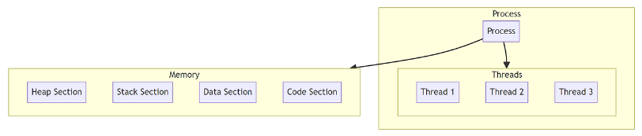
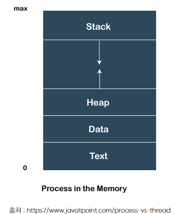
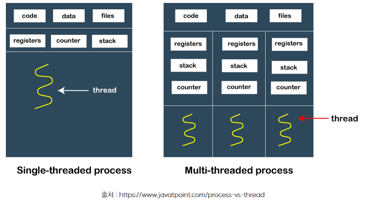
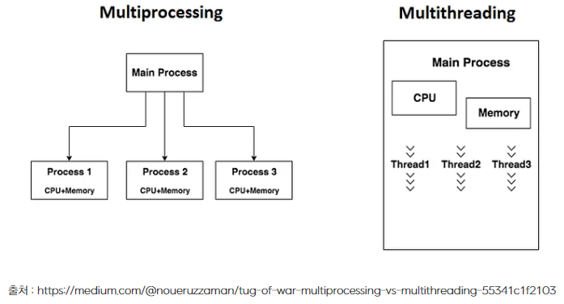
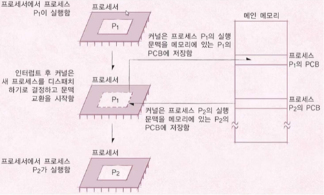

# 프로세스 vs 스레드

## 한 줄 요약

> 프로세스는 **서로 다른 메모리 공간**에서 실행, 스레드는 **공유 메모리 공간**에서 실행
> 즉, **메모리 공간의 독립성**에 대한 차이
> 
(출처 : https://somaz.tistory.com/265)

## 프로세스

- 정의 : **프로그램의 실행 중인 인스턴스**
- 설명
  : 특정 작업을 수행하기 위해 작성된 일련의 지침인 프로그램은 디스크나 다른 저장 매체에 저장되는 정적 엔티티이다.\n
  : 프로그램 실행 시 운영체제는 **디스크 -> 메모리**로 로드하고 실행\n
  : 이때, **프로그램은 프로세스가 되며**, 프로세스에는 **자체 메모리 공간**과 **시스템 자원**이 존재한다.\n
- 프로그램 vs 프로세스
  : 프로그램 => 프로세스 순으로 실행된다.\n
  : 프로그램은 정적이나 **프로세스는 동적이다.** 즉 프로그램 실행 시 생성되며 실행이 끝나면 삭제된다.\n
  : 동일한 프로그램의 여러 인스턴스를 동시에 실행하여 여러 프로세스를 생성할 수 있다.\n
  => 즉, 프로그램은 같은 코드이고, 프로세스는 코드가 실행될 때 발생하는 서로 다른 것이므로 각 프로세스는 **자체 메모리와 리소스**를 가지며 **독립적**이다.

## 스레드

- 정의 : **프로세스 실행 흐름의 단위**
- 설명
  : 프로세스의 병렬 실행을 가능하게 한다.\n
  : 즉, 프로세스는 최소 1개의 스레드를 가지며, 1개면 싱글스레드 환경, n개면 멀티스레드 환경이다.\n
- 프로세스 vs 스레드
<table>
    <tr>
        <th>차이점</th>
        <th>프로세스</th>
        <th>스레드</th>
    </tr>
    <tr>
        <td>정의</td>
        <td>실행 중인 프로그램의 인스턴스. 독립된 메모리 공간(코드, 데이터, 힙 등)을 가진다.</td>
        <td>프로세스 내에서 실행되는 실행의 흐름. 스레드는 프로세스의 자원을 공유한다.</td>
    </tr>
    <tr>
        <td>키워드</td>
        <td>격리 (Isolation)</td>
        <td>동시성 (Concurrency)</td>
    </tr>
    <tr>
        <td>메모리 공간</td>
        <td>각 프로세스는 별도의 주소 공간을 가지며, 다른 프로세스와 자원을 공유하지 않는다.</td>
        <td>같은 프로세스 내의 스레드들은 코드, 데이터, 힙 영역 등을 공유한다.</td>
    </tr>
    <tr>
        <td>통신 방법</td>
        <td>프로세스 간 통신(IPC)을 사용하여 데이터를 교환한다. 예: 파이프, 소켓, 공유 메모리 등.</td>
        <td>동일 프로세스 내의 스레드는 직접적으로 데이터와 자원을 공유한다.</td>
    </tr>
    <tr>
        <td>생성 및 관리 비용</td>
        <td>프로세스 생성은 많은 시간과 시스템 자원을 소모한다. 프로세스 스위칭 비용이 높다.</td>
        <td>스레드 생성과 전환은 프로세스에 비해 자원 소모가 적고 빠르다.</td>
    </tr>
    <tr>
        <td>독립성</td>
        <td>독립적 실행이 가능하며, 오류 발생 시 다른 프로세스에 영향을 미치지 않는다.</td>
        <td>하나의 스레드에 문제가 생기면 같은 프로세스 내의 다른 스레드에 영향을 줄 수 있다.</td>
    </tr>
    <tr>
        <td>사용 사례</td>
        <td>여러 개의 서로 다른 작업을 동시에 실행할 때 사용. 예: 워드 프로세서와 웹 브라우저가 동시에 실행되는 경우.</td>
        <td>동일한 작업을 여러 부분으로 나누어 병렬로 처리할 필요가 있을 때 사용. 예: 웹 서버에서 여러 클라이언트의 요청을 동시에 처리하는 경우.</td>
    </tr>
</table>

## 메모리 영역
* 프로세스

: Stack : 함수 호출, 로컬 변수, 함수 매개변수, 반환 주소 같은 **함수 실행 관련 정보**\n
: Heap : **동적으로 할당되는 데이터**를 위한 메모리 영역, 자바일 경우 모든 객체 및 배열을 저장하는 곳\n
: Data : **전역 변수, 정적 변수**, 프로그램 시작 시 할당, 종료 시 해제 \n
: Text : **코드**, 즉 컴파일된 프로그램의 기계어 코드가 저장됨, 읽기 전용\n
* 스레드

: 하나의 프로세스 내 모든 스레드들은 서로 상호 연관됨\n
: 공통 정보 : **데이터 세그먼트, 코드 세그먼트, 파일** 등\n
: 개별 정보 : **자체 레지스터, 스택 및 카운터**\n

## 멀티 프로세스 vs 멀티 스레드
> 멀티 프로세스 : 안정성, 느린 통신, 높은 오버헤드 => 메모리를 나누어 **안정성** 필요 시 사용
> 멀티 스레드 : 불안정성, 빠른 통신, 낮은 오버헤드 => **많은 문맥교환과 빠른 처리속도** 필요 시 사용

## 멀티 프로세스
* 정의 : 하나의 프로그램을 여러 개의 프로세스로 구성하여 각 프로세스가 병렬적으로 작업 수행
* 장점 : 안정성\n
: 즉, 각각 자체 메모리 공간이 있는 여러 프로세스가 사용됨\n
: 한 프로세스의 충돌에도 다른 프로세스에 직접적인 영향을 주지 않음\n
* 단점 : 느린 IPC 통신, 높은 오버헤드\n
: 프로세스 간 통신(IPC)은 스레드에 비해 더 복잡하고 느림\n
: 자체 메모리를 서로 가지고 있어 많은 메모리와 CPU 점유 시간을 가지며 문맥 교환의 비용, 즉 오버헤드가 높다.\n

## 멀티 스레드
* 정의 : 하나의 응용 프로그램에서 여러 스레드를 구성해 각 스레드가 하나의 작업을 처리하는 것
* 장점 : 빠른 통신, 낮은 오버헤드\n
: 동일한 메모리를 공유하므로 스레드 간의 정보를 더 쉽고 빠르게 공유할 수 있다.\n
: 위의 이유로 적은 메모리와 CPU 점유 시간을 가지며 문맥 교환의 비용, 즉 오버헤드가 낮다.\n
* 단점 : 불안정성\n
: 동일한 메모리를 공유하기에 경쟁 조건 및 교착 상태의 문제에 따라 한 스레드가 대기나 충돌 시 다른 스레드에게 직접적인 문제를 가할 수 있다.\n

## 문맥 교환 (Context Switching)
> 
출처 : 하비 디텔 , 폴 디텔 , 데이빗 쇼픈스의 운영체제론
* 정의 : 현재 CPU를 사용 중인 프로세스의 CPU 제어권이 다른 프로세스로 이양되는 과정
* 순서
(1)	요청 발생 : 인터럽트 또는 트랩에 의해 요청 발생
(2)	P1을 PCB에 저장 : 커널은 현재 실행 중인 P1의 실행 문맥을 P1의 PCB에 저장
(3)	P2를 PCB에서 불러옴 : 커널은 다음 P2의 실행 문맥을 P2의 PCB에 가져옴
(4)	P2를 CPU에 할당 : 커널이 가져온 P2를 CPU에 할당
* 오버헤드 : 문맥 교환에 드는 시간, 이 시간동안 CPU는 의미있는 작업이 불가능
* 스레드의 문맥 교환이 프로세스보다 오버헤드가 더 적게 든다.

## Reference
https://www.javatpoint.com/process-vs-thread

https://somaz.tistory.com/265

https://gmlwjd9405.github.io/2018/09/14/process-vs-thread.html

https://github.com/gyoogle/tech-interview-for-developer/blob/master/Computer%20Science/Operating%20System/Process%20vs%20Thread.md

https://github.com/devSquad-study/2023-CS-Study/blob/main/OS/os_process_thread.md

https://medium.com/@noueruzzaman/tug-of-war-multiprocessing-vs-multithreading-55341c1f2103
