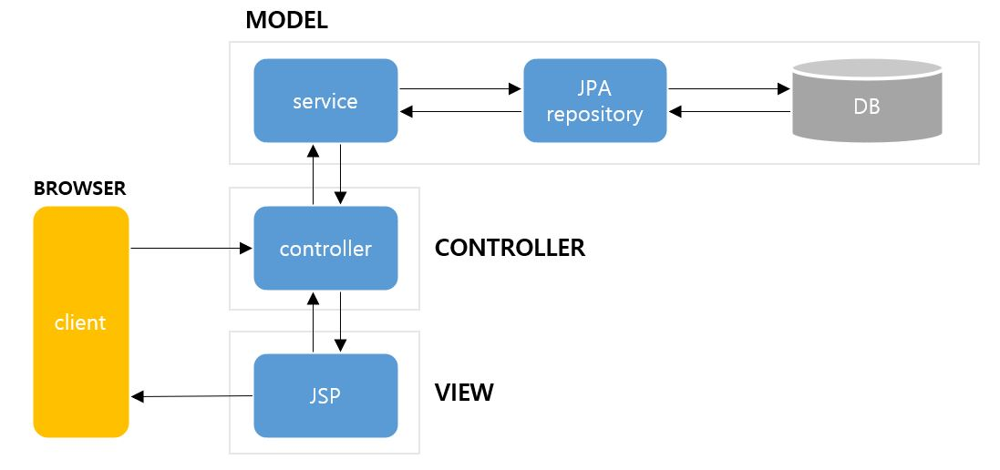

# MVC 패턴과 Rest API
* 작성 날짜 : 2024.06.04
* 작성자 : 류태웅

## MVC 패턴
* **한 줄 요약**
  * **MVC 패턴 : 애플리케이션을 Model, View, Controller 세 부분으로 분리하여 구조화하고 유지보수를 쉽게 해주는 소프트웨어 설계 패턴.**
  * **디자인 패턴 : 개발과 유지보수를 편리하게 해주는 소프트웨어 설계 규약의 집합**
  * **Model : 애플리케이션의 데이터와 비즈니스 로직을 관리하며, 데이터베이스와의 상호작용을 포함**
  * **View : 사용자에게 데이터를 시각적으로 보여주고, 사용자의 입력을 받는 역할**
  * **Controller : 사용자의 요청 처리, Model과 View를 연결하여 상호작용 관리**
* 설명
  * 사용자 인터페이스, 데이터 및 논리 제어를 구현할 때 사용되는 **디자인 패턴**
  * MVC는 Model, View, Controller의 약자, 하나의 애플리케이션, 프로젝트 구성 시 **구성 요소를 세가지의 역할로 구분한 패턴**
  * 디자인 패턴
  : 프로그램이나 어떤 특정한 것을 개발하는 중에 **발생했던 문제점들을 정리**해서 **상황에 따라 간편하게 적용해서 쓸 수 있는 것을 정리**하여 특정한 **규약**을 통해 **쓸 수 있는 형태로 만든 것**
    * ex
      * 앱 제작 시, 좀 더 쉽고 깔끔하게 만들 수 있는 방법을 고안해야 함, 명확히 하지 않으면 클래스 함수들을 일일히 다 만들어야 함
      * 예를 들어, 어떠한 data를 만들고 이 data를 수정할 로직을 작성 후, 그 **data를 보여주는 부분**을 만들 때, 이 하나하나가 **로직이 분리되지 않고 한번에 정의되어있으면 유지보수가 매우 힘들다.**
      * 이걸 돕기 위해 디자인 패턴이 나오는 것이며,  **"좀 더 쉽고 편리하게"** 사용할 수 있게 만든 특정한 방법들을 디자인 패턴이라고 한다.

* 구조
MVC 패턴의 구조 및 각 구성 요소의 역할과 요소 간의 관계, 상호작용을 간단하게 요약하자면 다음과 같이 정의한다.

사용자가 Controller를 통해 애플리케이션과 상호작용하면, Controller는 Model (정확히는 Repository)로부터 데이터를 받아오고, 그 데이터를 View를 통해 사용자에게 표시한다.
이를 알기 쉽게 절차로 정리하면서 풀어보자.
  > 절차
  > 1. 사용자의 Request(요청)을 Controller가 받음
  > 2. Controller는 Service를 호출하여 비즈니스 로직을 처리하고, Service는 Repository를 통해 데이터베이스와 상호작용
  > 3. Service에서 처리된 결과를 Controller가 받아서, 이를 View에 전달하여 사용자에게 시각적으로 표시

  2번째가 이해가 되질 않을 텐데, 갑작스레 Service와 Repository라는 용어가 나오기도 하고 저 내용이 축약된 내용이기에 생략된 내용이 많다.
  2번째만 따로 풀어써보자.

  > 2번째를 풀어쓴 절차.
  > 
  > 2-1. Controller는 비즈니스 로직을 수행하기 위해 Service 호출
  > 2-2. Service는 비즈니스 로직을 처리하면서 필요한 경우 Repository를 통해 데이터베이스와 상호작용
  > 2-3. Repository는 데이터베이스에서 데이터를 조회하거나 저장하는 작업 수행

  이제 위의 풀어쓴 내용을 포함한 구조를 만들어보면 다음과 같다.

  * 위의 흐름도를 다시 한번 정리해보면
  1. **Client** : 브라우저에서 요청을 보냄
  2. **Controller** : 요청을 받아서 Service를 호출함
  3. **Service** : 비즈니스 로직을 수행하고, 필요시 JPA Repository를 통해 DB와 상호작용
  4. **Repository(JPA)** : DB와의 CRUD 작업을 수행
  5. **DB** : 데이터를 저장하고 조회
  6. **JSP(View)** : 결과를 사용자에게 보여줌
  해당 절차로 동작한다고 보면 된다.
#### MVC Pattern-2와 Spring에서의 MVC 패턴
* MVC Pattern-1

  * View와 Model, DB가 직렬로 연결되어있어 간단한 어플리케이션 구현에는 쉬움
  * 그러나 프로그램이 커지면 View의 개수가 많아지고 관리도 어려워지기에 다양하고 복잡한 어플리케이션 구현, 유지보수 시 부적합함.
* MVC Pattern-2 (현재)

  * 클라이언트 요청을 Servlet으로 작성된 Controller가 먼저 받음
  * 응답은 JSP로 작성된 View가 담당하기에 2개의 기능이 분리됨
    * 분리되어 있기에 프로그램이 커져도 시스템 전체가 복잡해지는 것을 피할 수 있음
    * 또한, 각종 다양한 방식으로 controller와 view를 구현할 수 있어 다양한 어플리케이션의 구성도 가능함
  * 현재 Spring에서 이 MVC 패턴을 채용하여 사용 중
* Spring Framework의 MVC Pattern

1. Client로부터 요청이 들어오면 DispatcherServlet 호출됨
2. DispatcherServlet => HandlerMapping
2-1. 받은 요청을 HandlerMapping에게 던져줌
2-2. 요청받은 URL을 분석하여 HandlerMapping의 적합한 Controller를 선택하여 반환
3. DispatcherServlet => HandlerAdapter
3-1. DispatcherServlet이 2번 과정을 완료하면 HandlerAdapter 호출
3-2. HandlerAdapter는 해당하는 Controller 중 요청한 URL에 맞는 적합한 Method를 찾음
4. Controller는 비즈니스 로직을 처리하고 해당하는 결과를 View에 전달할 객체를 Model에 저장
5. Controller는 View Name을 DispaterServlet에게 리턴
6. DispatcherServlet => ViewResolver
6-1. DispatcherServlet은 ViewResolver를 호출
6-2. Controller가 리턴한 View Name을 기반으로 적합한 View를 찾음
7. DispatcherServlet은 View 객체에 처리 결과를 넘겨 최종 결과를 보여주도록 요청
8. View 객체는 해당하는 View를 호출하며 View는 Model 객체에서 화면에 필요한 객체를 가져와 화면 표시를 처리하고 Client에게 넘겨줌

### 책임의 분리 (Separation of Concerns)
* MVC 패턴의 핵심 원칙 중 하나로, **각 컴포넌트는 자신의 역할에 충실해야 한다.**
* 예를 들어, View가 Model의 정보를 가지게 될 경우 이 원칙이 깨지고, 각 컴포넌트의 역할이 혼란스러워진다.
* 당연하게도 이 분리를 위반할 시, 유지보수에서의 문제점이나 코드 중복, 의존성 관리에서의 강한 결합으로 인한 저해 등의 문제들이 일어나기에, 모든 MVC 구조의 애플리케이션에서 반드시 지켜야할 규칙이다.

### Model
* 애플리케이션의 **핵심 데이터와 비즈니스 로직**
* **데이터 저장소와의 상호 작용, 데이터 처리 및 유효성 검사와 같은 작업 수행**
* **독립적**으로 작동하며, **뷰와 컨트롤러와 직접적으로 통신하지 않음**
* 규칙
  * **사용자가 편집하길 원하는 모든 데이터를 가지고 있어야 한다.**
    * 즉, 화면 안의 박스에 글자 표현 시, 박스의 화면 위치 정보, 박스의 크기 정보, 글자 내용, 글자 위치, 글자의 포맷 정보 등 사용자가 편집하길 원하는 데이터를 모델이 가지고 있어야 함
  * **View나 Controller에 대해서 어떠한 정보도 알아선 안된다.**
    * 데이터 변경이 일어났을 때 모델에서 화면 UI를 직접 조정해서 수정할 수 있도록 함
    * 즉, 뷰를 참조하는 내부 속성값을 가지면 안 된다는 말
  * **변경이 일어나면, 변경 통지에 대한 처리방법을 구현해야 한다.**
    * 모델의 속성 중 텍스트 정보 변경 시, 이벤트를 발생시켜 누군가에게 전달해야함
    * 누군가가 이 모델을 변경하도록 요청하는 이벤트를 보냈을 때 이를 수신할 수 있는 처리 방법을 구현해야 함
    * 모델은 재사용이 가능해야하며, 다른 인터페이스에서도 변하지 않아야 함
#### Service
* 비즈니스 로직 처리
  * 정확히는, 비즈니스 로직을 캡슐화
* 복잡한 비즈니스 로직이 Model과 분리되어 처리되며, 여러 Repository와 상호작용 가능
#### Repository (a.k.a DAO)
* 데이터베이스와의 상호작용 (ex : Mybatis, JPA)
* 데이터 접근 로직을 캡슐화하여 데이터베이스와 통신
### View
* input 텍스트, 체크박스 항목같은 사용자 인터페이스 요소를 나타냄
  * 다시 말해, 데이터 및 객체의 입력, 그리고 보여주는 출력을 담당하며, 데이터를 기반으로 사용자들이 볼 수 있는 화면
* Client와는 별개이다.
  * Client : 서버에 요청을 보내는 사용자 측 애플리케이션(브라우저)
  * View : 서버 측에 위치하여 사용자가 볼 수 있는 화면을 생성하고, 클라이언트에 응답으로 전송
  * 즉, View가 화면을 렌더링하여 HTML 형태로 Client에게 응답을 보내면 Client 측 애플리케이션인 브라우저는 서버로부터 받은 HTML을 렌더링하여 사용자에게 보여주는 관계이다.
* 규칙
  * **모델이 가지고 있는 정보를 따로 저장해선 안된다.**
    * 예를 들어 화면에 글자를 표시하기 위해 모델이 가지고 있는 정보를 전달받게 되는데, 그 정보를 유지하기 위해 임의의 뷰 내부에 저장하지 말아야 함
      * 단순히 네모 박스를 그리라는 명령을 받으면 화면에 표시만 해야 함
      * 위에서 그릴 때 필요한 정보들은 저장해선 안 됨
  * **모델이나 컨트롤러와 같은 다른 구성 요소들을 몰라야한다.**
    * 모델은 자기 자신 빼고 다른 요소는 참조하거나 어떻게 동작하는지에 대해 알면 암됨
    * 그냥 말 그대로, 데이터를 받으면 화면에 표시만 해줘야 함
  * **변경이 일어나면 변경 통지에 대한 처리방법을 구현해야만 한다.**
    * 모델과 같이 변경이 일어날 때 다른 누군가에게 변경을 알려줘야 함
    * 화면에서 사용자가 화면에 표시된 내용을 변경하게 되면 뷰는 이 변경 사항을 모델에게 전달해서 모델을 변경해야하는 것
    * 그렇기에 위 작업을 위해서 변경 통지를 구현하는 것
    * 처리 방법 설계 및 구현 시 재사용이 가능하게끔 설계해야하며, 다른 정보들을 표현할 때 쉽게 설계해야 함
### Controller
* 데이터의 역할을 하는 Model과 사용자 인터페이스 역할을 하는 View를 **이어주는 다리**
* 즉, 사용자가 데이터를 클릭하고 수정하는 것에 대한 **이벤트를 처리하는 부분**
* 규칙
  * **모델이나 뷰에 대해 알고 있어야 한다.**
    * 위의 Model이나 View처럼 서로의 존재는 모르고, 변경을 외부에 알리고, 수신하는 방법만 가지는 것이 아님
    * 컨트롤러는 위를 중재하지 위해 모델과 그에 관련된 뷰에 대해 알고 있어야 함
  * **모델이나 뷰의 변경을 모니터링 해야 한다.**
    * 모델이나 뷰의 변경 통지를 받으면 이를 해석해 각각의 구성 요소에게 통지해야 함
    * 그렇기에, 애플리케이션의 **메인 로직은 컨트롤러가 담당함**
### 예제
* 위 내용들로 각 요소와 MVC 패턴의 전체적인 구조를 설명하였지만 예시가 없어 와닿지는 않을 것이다. 그렇기에 간단한 예시를 들어 전체 구조를 코드로 설명하고자 한다.
## Rest API

## Reference
* [Spring의 MVC 패턴과 MVC1과 MVC2 비교](https://chanhuiseok.github.io/posts/spring-3/)
* [MVC 패턴](http://www.techblue.co.kr/?page_id=5464)
* [MVC 패턴의 구현 원리](https://dataonair.or.kr/db-tech-reference/d-lounge/technical-data/?mod=document&uid=236268)
* [개발자 면접 준비 : MVC 패턴](https://m.blog.naver.com/jhc9639/220967034588)
* [mdn web docs : MVC](https://developer.mozilla.org/ko/docs/Glossary/MVC)
* [MVC (Model-View-Controller) 패턴](https://mundol-colynn.tistory.com/147)