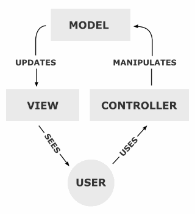

# MVC 패턴과 Rest API
* 작성 날짜 : 2024.06.04
* 작성자 : 류태웅

## MVC 패턴
* **한 줄 요약**
  * **MVC 패턴 : 애플리케이션을 Model, View, Controller 세 부분으로 분리하여 구조화하고 유지보수를 쉽게 해주는 소프트웨어 설계 패턴.**
  * 디자인 패턴 : 개발과 유지보수를 편리하게 해주는 소프트웨어 설계 규약의 집합
  * **Model : 애플리케이션의 데이터와 비즈니스 로직을 관리하며, 데이터베이스와의 상호작용을 포함**
    * ex : 데이터베이스, 도메인 객체와 이를 관리하는 Repository, JPA
  * **View : 사용자에게 데이터를 시각적으로 보여주고, 사용자의 입력을 받는 역할**
    * ex : 프론트앤드 (React, JSP 등)
  * **Controller : 사용자의 요청 처리, Model과 View를 연결하여 상호작용 관리**
    * ex : Spring의 @GetMapping같은 어노테이션으로 사용자 요청 처리, Model과 View와의 상호작용
* 설명
  * 사용자 인터페이스, 데이터 및 논리 제어를 구현할 때 사용되는 **디자인 패턴**
  * MVC는 Model, View, Controller의 약자, 하나의 애플리케이션, 프로젝트 구성 시 **구성 요소를 세가지의 역할로 구분한 패턴**
  * 디자인 패턴
  : 프로그램이나 어떤 특정한 것을 개발하는 중에 **발생했던 문제점들을 정리**해서 **상황에 따라 간편하게 적용해서 쓸 수 있는 것을 정리**하여 특정한 **규약**을 통해 **쓸 수 있는 형태로 만든 것**
    * ex
      * 앱 제작 시, 좀 더 쉽고 깔끔하게 만들 수 있는 방법을 고안해야 함, 명확히 하지 않으면 클래스 함수들을 일일히 다 만들어야 함
      * 예를 들어, 어떠한 data를 만들고 이 data를 수정할 로직을 작성 후, 그 **data를 보여주는 부분**을 만들 때, 이 하나하나가 **로직이 분리되지 않고 한번에 정의되어있으면 유지보수가 매우 힘들다.**
      * 이걸 돕기 위해 디자인 패턴이 나오는 것이며,  **"좀 더 쉽고 편리하게"** 사용할 수 있게 만든 특정한 방법들을 디자인 패턴이라고 한다.
* 구조
MVC 패턴의 구조 및 각 구성 요소의 역할과 요소 간의 관계, 상호작용을 간단하게 요약하자면 다음과 같이 정의한다.

사용자가 Controller를 통해 애플리케이션과 상호작용하면, Controller는 Model (정확히는 Repository)로부터 데이터를 받아오고, 그 데이터를 View를 통해 사용자에게 표시한다.
이를 알기 쉽게 절차로 정리하면서 풀어보자.
  > 절차
  > 1. 사용자의 Request(요청)을 Controller가 받음
  > 2. Controller는 Service를 호출하여 비즈니스 로직을 처리하고, Service는 Repository를 통해 데이터베이스와 상호작용
  > 3. Service에서 처리된 결과를 Controller가 받아서, 이를 View에 전달하여 사용자에게 시각적으로 표시

  2번째가 이해가 되질 않을 텐데, 갑작스레 Service와 Repository라는 용어가 나오기도 하고 저 내용이 축약된 내용이기에 생략된 내용이 많다.
  2번째만 따로 풀어써보자.
* > 2번째를 폴어쓴 절차.
> 2-1. Controller는 비즈니스 로직을 수행하기 위해 Service 호출
> 2-2. Service는 비즈니스 로직을 처리하면서 필요한 경우 Repository를 통해 데이터베이스와 상호작용
> 2-3. Repository는 데이터베이스에서 데이터를 조회하거나 저장하는 작업 수행

이제 위의 풀어쓴 내용을 포함한 구조를 보자.

### Model
#### Repository
#### Service
### View
### Controller
### 예제
## Rest API