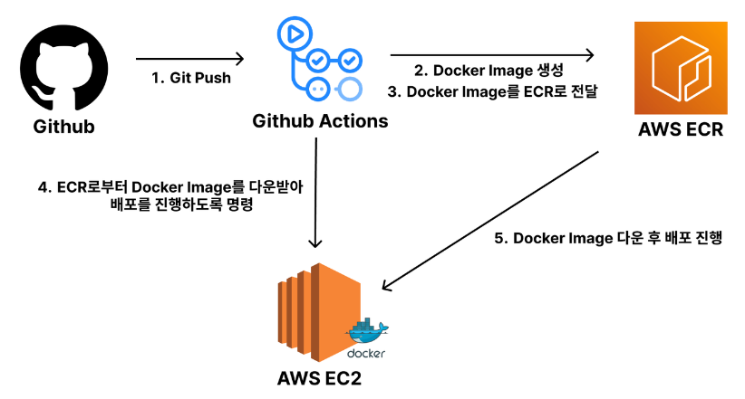

# CI/CD
- 스터디 일시 : 24.08.01

## CI (지속적 통합, Continuous Integration)
- 여러 개발자가 각자의 작업을 중앙 저장소에 지속적으로 통합하고, 이를 자동으로 테스트하여 통합 버그를 최소화하는 프로세스

### 특징
- 코드 변경 사항이 발생(push)할 때마다 자동으로 빌드/테스트 실행
- 개발자들은 자주 코드를 통합할 수 있으며 코드 충돌을 미리 발견할 수 있음
- 이를 통해 품질 관리 및 버그 발견이 빨라짐

## CD (지속적 배포, Continuous Deployment)
- CI 이후의 과정, 통합된 코드를 자동으로 프로덕션 환경에 배포하는 프로세스

### 특징
- 코드 변경 사항이 테스트 및 승인을 거쳐 자동으로 프로덕션 환경에 배포
- 새로운 기능과 버그 수정 사항이 실제 사용자에게 빠르게 제공됨
- 이를 통해 사용자 피드백 수집 및 제품 개선 속도 향상

## 도구 : Github Action
- Github에서 제공하는 Github Action 외 Jenkins 등 많은 도구가 존재
- Github Action은 Repository에 push/pull에 따라 자동으로 작업을 수행하도록 만들 수 있음
- 위 CI/CD를 자동으로 수행하는 하나의 컴퓨터로 보면 된다.

### 사용법
1. 해당 Repository의 최상단에 .github/workflows 폴더를 만든다.
2. 이 폴더 안의 yaml 파일을 Github Actions가 인식하는 것 (파일명은 상관 없음)

## 배포에서의 CI/CD : EC2, ECR, Docker, Github Action

1. Github Action
- .github/workflows에 deploy.yml을 만든다.
- 이 yml 파일 안에 Docker 이미지 생성 및 ECR에게 전달, EC2에게의 명령을 정의
<details>
<summary>CI/CD 파이프라인 예시 코드 (deploy.yml)</summary>

```yml
name: zzaekkac server deploy

# main 브랜치에 push 이벤트가 발생했을 때 이 워크플로우를 실행합니다.
on:
  push:
    branches:
      - main

# jobs: 이 워크플로우에서 수행할 작업들을 정의합니다.
jobs:
  build:
    # 이 작업을 실행할 환경을 지정합니다. 여기서는 최신 버전의 Ubuntu를 사용합니다.
    runs-on: ubuntu-latest

    # steps: 작업 내에서 수행할 명령어들을 순차적으로 정의합니다.
    steps:
      # 첫 번째 단계: Github 레포지토리를 체크아웃합니다. 이는 git clone과 유사하게, 현재 레포지토리의 내용을 가져옵니다.
      - name: Github Repository Load
        uses: actions/checkout@v4

      # 두 번째 단계: JDK 17을 설치합니다. 이는 자바 애플리케이션을 빌드하고 실행하기 위한 환경을 설정합니다.
      - name: Set up JDK 17
        uses: actions/setup-java@v3
        with:
          java-version: '17'
          distribution: 'temurin'

      # 세 번째 단계: application.properties 파일을 생성합니다. 이는 환경 설정 파일로, 필요한 설정 값을 넣습니다.
      - name: application.properties 파일 생성
        run: echo "${{ secrets.APPLICATION_PROPERTIES }}" > ./src/main/resources/application.properties

      # 네 번째 단계: Gradle을 사용하여 애플리케이션을 빌드합니다. 여기에는 테스트도 포함될 수 있습니다.
      - name: Build with Gradle
        run: ./gradlew clean build

      # 다섯 번째 단계: AWS 자격 증명을 설정합니다. 이는 AWS와 상호 작용하기 위한 인증 정보를 설정합니다.
      - name: AWS Credentials
        uses: aws-actions/configure-aws-credentials@v4
        with:
          aws-region: ap-northeast-2
          aws-access-key-id: ${{ secrets.AWS_ACCESS_KEY_ID }}
          aws-secret-access-key: ${{ secrets.AWS_SECRET_ACCESS_KEY }}

      # 여섯 번째 단계: AWS ECR에 로그인합니다. ECR은 Docker 이미지를 저장할 수 있는 AWS의 컨테이너 레지스트리 서비스입니다.
      - name: Login to AWS ECR
        id: login-ecr
        uses: aws-actions/amazon-ecr-login@v2

      # 일곱 번째 단계: Docker 이미지를 빌드합니다. 이는 Dockerfile을 기반으로 애플리케이션의 이미지를 생성합니다.
      - name: Docker image build
        run: docker build -t zzaekkac-server .

      # 여덟 번째 단계: Docker 이미지를 태깅합니다. 이는 이미지를 ECR에 푸시하기 위해 태그를 설정하는 단계입니다.
      - name: Docker tag
        run: docker tag zzaekkac-server ${{ steps.login-ecr.outputs.registry }}/zzaekkac-server:latest

      # 아홉 번째 단계: Docker 이미지를 ECR에 푸시합니다. 이는 태그된 이미지를 AWS ECR로 업로드하는 단계입니다.
      - name: Docker push
        run: docker push ${{ steps.login-ecr.outputs.registry }}/zzaekkac-server:latest

      # 열 번째 단계: SSH를 통해 EC2 인스턴스에 접속합니다. 이는 원격 서버에 접근하여 명령을 실행하기 위한 단계입니다.
      - name: ssh
        uses: appleboy/ssh-action@master
        with:
          host: ${{ secrets.EC2_HOST }}
          username: ${{ secrets.EC2_USERNAMAE }}
          key: ${{ secrets.EC2_PRIVATE_KEY }}
          script_stop: true
          script: |
            # 현재 실행 중인 Docker 컨테이너를 중지합니다. 서버가 중지되어도 오류를 무시하도록 '|| true'를 추가했습니다.
            docker stop zzaekkac-server || true
            # 중지된 Docker 컨테이너를 삭제합니다. 이미 컨테이너가 없더라도 오류를 무시하도록 '|| true'를 추가했습니다.
            docker rm zzaekkac-server || true
            # ECR로부터 최신 Docker 이미지를 가져옵니다.
            docker pull ${{ steps.login-ecr.outputs.registry }}/zzaekkac-server:latest
            # 새로운 Docker 컨테이너를 실행합니다. 8080 포트를 매핑하여 외부에서 접근할 수 있도록 설정했습니다.
            docker run -d --name zzaekkac-server -p 8080:8080 ${{ steps.login-ecr.outputs.registry }}/zzaekkac-server:latest
```
</details>

2. Docker
- 애플리케이션을 컨테이너라는 독립된 환경에서 실행할 수 있도록 해주는 가상화 기술
- Docker 이미지 : 애플리케이션 실행에 필요한 모든 요소를 포함하는 불변의 파일 시스템
- 이를 통해 애플리케이션의 배포 및 실행 환경을 일관되게 유지할 수 있음

3. ECR
- AWS 관리형 컨테이너 이미지 레지스트리 서비스
- AWS IAM 인증을 통해 이미지에 대한 push/pull에 대한 관리 가능
- Repository를 사용하여 Docker Image 관리

4. EC2
- AWS에서 제공하는 서버 가동용 가상 컴퓨터
- 서버 배포를 위해 "24시간" 켜놔야 함

## Reference
- [CI/CD의 중요성과 GitHub Actions 소개](https://f-lab.kr/insight/building-ci-cd-with-github-actions)
- [Docker + Git Action을 활용하여 Spring Boot Project CI/CD 구축](https://velog.io/@jjinwo0/Docker-Docker-Git-Action%EC%9D%84-%ED%99%9C%EC%9A%A9%ED%95%98%EC%97%AC-Spring-Boot-Project-CICD-%EA%B5%AC%EC%B6%95)
- [째깍 서비스 백엔드 CI/CD 과정](https://github.com/dnd-side-project/dnd-11th-7-backend/discussions/11)