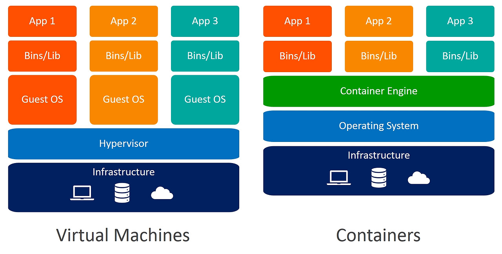
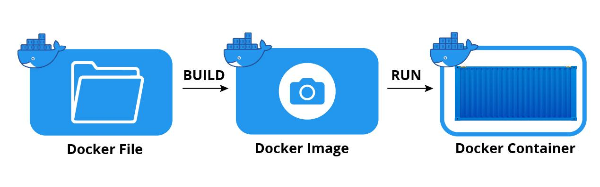
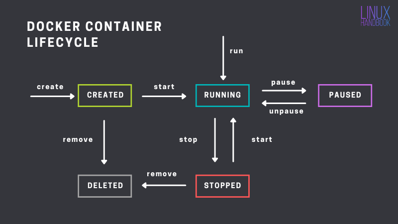

# Docker
- 스터디 일시 : 24.08.08

## 도커란?
* 컨테이너 기반 가상화 플랫폼
* 응용 프로그램과 그 종속성을 격리된 환경인 컨테이너로 패키징하여 실행하는 기술
> 이를 통해 개발 환경과 운영 환경 사이의 차이로 인한 문제를 줄일 수 있다.

### 핵심 개념
* 컨테이너
  * 가상화 기술을 이용하여 어플리케이션과 개발 환경을 격리된 공간에서 실행하는 단위
  * 컨테이너 vs 가상머신
  
    * 가상 머신
      * 기존의 가상화 기술인 가상 머신은 하이퍼바이저(Hypervisor)를 이용해 여러개의 운영 체제를 하나의 호스트에서 생성해서 사용하는 방식 (이때 이 운영체제를 Guest OS라고 함)
      * 시스템 자원을 가상화하고 독립된 공간을 생성하는 작업은 하이퍼바이저를 거치므로 성능 손실이 큼
      * 그리고 가상 머신은 **Guest OS를 사용하기 위해 라이브러리, 커널을 모두 포함**
        * 가상 머신을 배포하기 위한 이미지로 만들었을 때 이미지의 크기 또한 커짐
    * 컨테이너
      * 위와 달리 컨테이너는 호스트 운영체제의 커널을 공유하며 가볍게 격리된 환경을 생성 -> 가상머신보다 더 가벼우며 효율적으로 실행
        * 즉, 가상화된 공간 생성 시 리눅스 자체 기능을 사용하여 프로세스 단위의 격리 환경을 만들기에 성능 손실이 없음
        * 또한, 커널을 공유해서 사용하고, 컨테이너에는 라이브러리, 실행 파일만 있기에 이미지의 용량이 적음
        > 컨테이너를 이미지로 만들었을 때 배포하는 시간과 사용할 때의 성능에서 우위를 점할 수 있음

* 이미지
  * 컨테이너를 생성하기 위한 파일 시스템과 실행할 애플리케이션의 소스 코드, 라이브러리, 환경 설정 등의 모든 것을 포함하는 템플릿
  * 읽기 전용, 도커 컨테이너 시작 시 해당 이미지가 기반이 됨 (가상 머신 생성 시 사용하는 .iso와 비슷하다.)
  * 여러개의 레이어로 구성되어 있는데 각 레이어는 변경 사항이 있는 파일 또한 설정을 포함하고 있으며, 이들 레이어는 상속 구조를 가지고 쌓여 최종 이미지 구성
    * 이 레이어 구조를 통해 이미지 간 공통된 부분을 효율적으로 공유 가능
  * 이 이미지는 Docker File이라는 텍스트 파일을 사용하여 정의
  > 한마디로, 도커 이미지는 개발 환경 보따리라고 생각하면 된다.
  > 어떤 운영체제에 어떤 개발 환경이 세팅되어 있고, 어떤 개발을 위해 도커 이미지를 가져와서 컨테이너를 생성하면 특정 개발 환경이 세팅됨

  * 이미지와 컨테이너 간의 관계
    * 이미지를 실행한 격리된 프로세스 환경으로 도커 이미지를 실행하면 컨테이너가 됨
    * 이미지와 컨테이너는 1:N 관계
      * 운영체제에서의 프로그램/프로세스, 객체지향이서의 클래스/인스턴스로 생각하면 편하다.
      
        * Docker File -> Docker Image
          * Docker File은 도커 이미지를 만들때 사용하는 파일. docker build 명령어를 실행시키면 도커 이미지를 만들 수 있음
        * Docker Image -> Docker Container
          * Docker Image를 docker run 명령어를 실행시키면 Docker Container를 만들 수 있음

### 컨테이너의 라이프사이클

## Reference
- [도커란? : 본격적인 튜토리얼](https://seosh817.tistory.com/345)
- [도커는 왜 사용하는 걸까?](https://mvje.tistory.com/161)
- [Docker가 왜 좋은지 5분만에 설명해줌 : 노마드코더](https://youtu.be/chnCcGCTyBg?si=lL4d2iitiFEXwDlv)